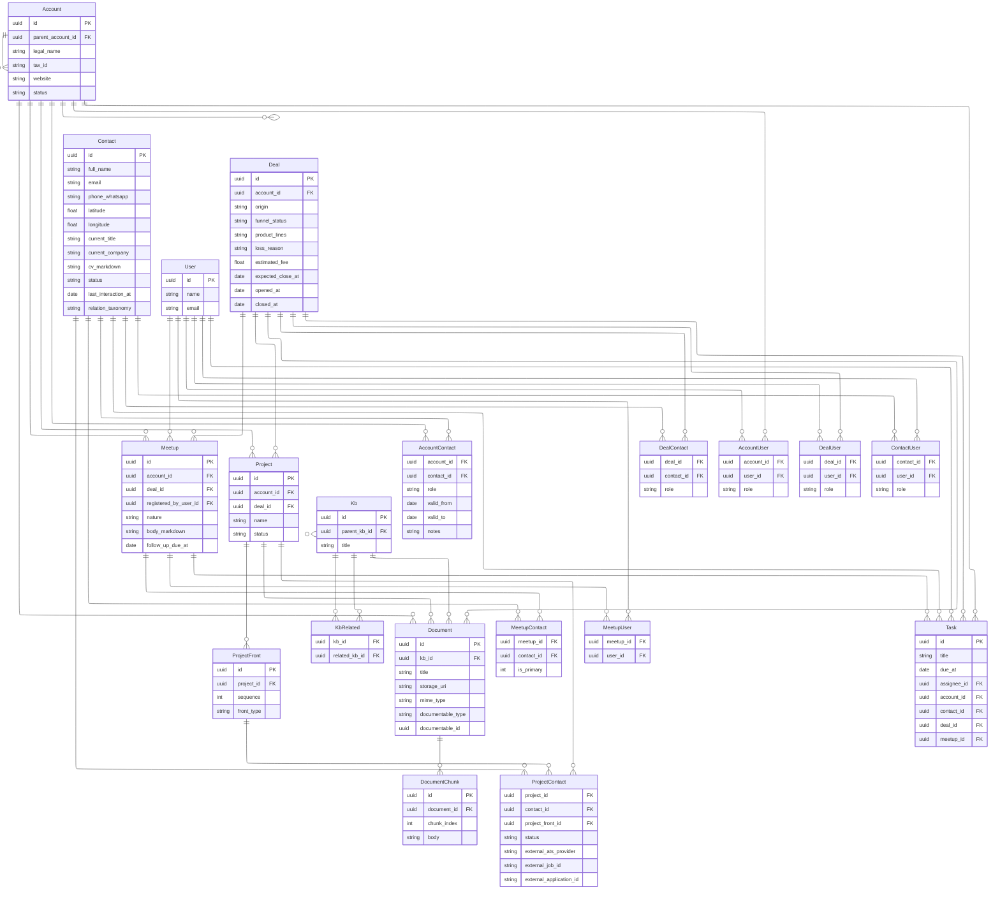

# Modelagem de dados — Navegador Plongê

Documento conceitual alinhado ao PRD ([`produto_funcionalidades.md`](produto_funcionalidades.md)), às telas ([`mapa_de_telas.md`](mapa_de_telas.md)) e à persistência descrita em [`arquitetura_tecnica_plia2.md`](arquitetura_tecnica_plia2.md).

**Nomes canónicos das entidades:** inglês (implementação e diagramas). Glossário: **Account** = conta cliente (*empresa* no contexto da tarefa); **Contact** = contato; **Deal** = negócio / oportunidade (*deal*); **Meetup** = registo de interação (**conversa** no produto); **Project** = projeto; **ProjectFront** = frente do projeto (etapa sequencial); **Kb** = entrada de conhecimento (*knowledge base*); **Task** = tarefa; **Document** = ficheiro/anexo; **User** = utilizador Plongê.

---

## Princípio: Account e módulo Empresas

**Account** é a organização cliente (cliente da Plongê). O módulo **Empresas** (indústrias, hierarquia, grupo econômico) usa a **mesma entidade Account**. A hierarquia entre contas é um **auto-relacionamento**: cada account tem no máximo um **`parent_account_id`** (FK opcional para **Account**); contas raiz têm `parent_account_id` nulo.

---

## 1. Fatos operacionais (CRM)

### 1.0 Contact em Account e em Deal (N:N com papel)

**Contact** não é filho exclusivo de uma única account nem único por deal: os vínculos são **linhas na tabela de relacionamento** com atributos de **role** (papel) nesse contexto.

| Relacionamento | Tabela | Atributos no vínculo |
|----------------|--------|----------------------|
| Account ↔ Contact | `account_contact` | `role` (ex.: decisor, influencer, buyer), `valid_from`, `valid_to`, `notes` |
| Deal ↔ Contact | `deal_contact` | `role` (ex.: sponsor, technical) |

### 1.1 Meetup

| Atributo | Notas |
|----------|--------|
| **registered_by_user_id** | FK → `users` — quem **registou** o meetup no sistema |
| **participantes** | N:N via **`meetup_user`** |
| **contatos** | N:N via **`meetup_contact`** (inclui marcação de contato principal — ver tabela) |
| **account_id** | FK **Account** |
| **deal_id** | FK **Deal** (opcional) |
| **nature** | enum / taxonomia |
| **body_markdown** | texto da interação em **Markdown** (notas, resumo, conteúdo rico) |
| **follow_up_due_at** | data |

*Owners comerciais* podem mapear-se a **`account_user`** / **`deal_user`** ou a regras sobre participantes.

### 1.2 Deal / proposta

| Atributo | Notas |
|----------|--------|
| equipa / responsáveis | N:N **`deal_user`** |
| **account_id** | FK **Account** |
| contatos | via **`deal_contact`** (papel por linha) |
| **origin** | base, cold, evento, referral |
| **funnel_status** | conversa exploratória 10% · oportunidade 25% · proposta/negociação 60% · fechado 100% · perdido 0% |
| **product_lines** | C-level, diretoria, gerência, etc. (enum multi ou tabela) |
| **loss_reason** | texto/enum |
| **estimated_fee** | decimal |
| **expected_close_at** | data |
| **opened_at** / **closed_at** | datas (CAC) |

**Projects (1:N):** um **Deal** pode ter **vários** **Project**; em **`project`** usa-se **`deal_id`** (FK opcional) quando o projecto decorre desse negócio. **Account** continua a ser o contexto de cliente (**`account_id`** em **Project**); regra de integridade: se **`deal_id`** estiver preenchido, o **Deal** referido tem de pertencer à mesma **Account** que **`project.account_id`**.

---

## 2. Projetos e pessoas — ATS interno

**Não há entidade Candidate separada de Contact:** quem concorre é **Contact**; a **candidatura** é a linha em **`project_contact`** (participação no projecto) com **status** e, quando aplicável, ligação a uma **frente**.

| Entidade | Descrição |
|----------|-----------|
| **Project** | Pertence a **Account** (`account_id`); opcionalmente a um **Deal** (`deal_id`) quando há vários projectos ligados ao mesmo negócio (**1:N** Deal → Project); **frentes** (`ProjectFront`), documentos, meetups. |
| **`project_contact`** | Participação **Contact ↔ Project** (“candidato”): `project_id`, `contact_id`, **`project_front_id`** (opcional — frente actual ou à qual está alocado), **status** (triagem, entrevista, aprovado, …), metadados de candidatura / ATS. |
| **`ProjectFront`** (*frente*) | Pertence a um **Project**; **`sequence`** define a ordem **sequencial** das frentes (1, 2, 3, …); **`front_type`** enum (tipo da frente — valor canónico a fechar com produto, ex.: técnica, cultural, cliente). |
| **Interview** (Entrevista) | Registos + feedbacks (analytics e RAG); FK **Contact** e **Project**. |
| **Document** | Polimórfico: **Account**, **Deal**, **Project**; outros alvos (`Meetup`, `Interview`, …) conforme implementação. |

**Regras das frentes:** cada **Project** define N linhas **`project_front`** ordenadas por **`sequence`**. Os **candidatos** são entradas em **`project_contact`**; **`project_front_id`** indica em que frente o candidato está (ou está activo). Ao **avançar** na sequência, actualiza-se essa FK e/ou o **status**. Integridade: se **`project_front_id`** está preenchido, o **`ProjectFront`** tem de pertencer ao **mesmo** **`project_id`** que a linha de **`project_contact`**.

### 2.1 Integração com ATS do cliente (v2+ — conceitual)

Metadados por linha em **`project_contact`** quando aplicável:

- `external_ats_provider` (`gupy`, `greenhouse`, `successfactors`, …)
- `external_job_id` / `external_application_id`

---

## 3. Dimensões mestras

### 3.1 Account

| Atributo | Notas |
|----------|--------|
| responsáveis | N:N **`account_user`** |
| vínculo a contatos | **`account_contact`** |
| **status** | ativo / arquivado |
| **legal_name**, **tax_id**, **website**, … | cadastro |
| hierarquia entre contas | **`parent_account_id`** → **Account** (opcional; raiz = nulo) |

### 3.2 Contact

| Atributo | Notas |
|----------|--------|
| responsáveis | N:N **`contact_user`** |
| **status**, **last_interaction_at** | |
| **relation_taxonomy** | secção 7 — complementa **roles** nas tabelas de junção |
| **full_name** | nome completo |
| **email** | |
| **phone_whatsapp** | telefone **WhatsApp** (formato normalizado no DDL) |
| **geoloc** | localização — **`latitude`** / **`longitude`** (opcionais) ou tipo **`geography`/PostGIS** conforme implementação |
| **current_title** | cargo atual |
| **current_company** | empresa atual (texto; pode evoluir para FK **Account** no futuro) |
| **cv_markdown** | CV rico em **Markdown** |
| projetos | **`project_contact`** (papel “candidato” = mesma pessoa, outra tabela) |

---

## 4. Tarefas

Entidade transversal **`task`** (**Task**): cada registo tem um **contexto** — exactamente **um** entre:

| Contexto (produto) | Entidade | FK na tabela `task` (uma delas preenchida) |
|--------------------|----------|---------------------------------------------|
| Empresa (conta cliente) | **Account** | **`account_id`** |
| Contato | **Contact** | **`contact_id`** |
| Negócio (*deal*) | **Deal** | **`deal_id`** |
| Conversa | **Meetup** | **`meetup_id`** |

**Regra:** entre **`account_id`**, **`contact_id`**, **`deal_id`**, **`meetup_id`**, **uma e só uma** é não nula (CHECK no DDL ou validação na aplicação). Não há contexto **Project** neste modelo de tarefa.

Atributos típicos: **`id`** (PK), **`title`**, **`due_at`**, **`assignee_id`** → **User**.

---

## 5. Conhecimento (*KB*) e RAG

O conhecimento organiza-se em **Kb** (uma linha na tabela **`kb`**). Cada **`Kb`** tem obrigatoriamente um **`id`** (PK).

| Entidade | Uso |
|----------|-----|
| **`kb`** | Unidade de conhecimento: **`id`** (PK), **`parent_kb_id`** opcional (no máximo **um** pai por KB — hierarquia em árvore), metadados de conteúdo (ex.: título, corpo Markdown — detalhe no DDL). |
| **`kb_related`** | Referências **entre** KBs: N:N — cada KB pode ter **N** relacionamentos a **outros** KBs (`kb_id` ↔ `related_kb_id`). Evitar duplicar pares inúteis; opcionalmente tipificar o vínculo (`relation_kind`) no DDL. Não confundir com pai/filho: **pai** é só **`parent_kb_id`**. |
| **documents** | Metadados + `documentable` (polimórfico); opcionalmente **`kb_id`** para anexar ficheiros a uma entrada **Kb**. Continua a poder ligar-se a **Account**, **Deal**, **Project**, etc. |
| **document_chunks** | Texto chunkado + `embedding` (pgvector); fonte típica = **Document** e/ou corpo indexável da **Kb**, conforme pipeline. |

**Regras:** dentro de um **Kb** o utilizador **referencia outros Kbs** via linhas em **`kb_related`** (grafo de relacionados). Hierarquia **pai → filhos**: apenas **`parent_kb_id`** (0 ou 1 pai).

Pipeline e segurança: [`arquitetura_tecnica_plia2.md`](arquitetura_tecnica_plia2.md) §5–6.

---

## 6. Utilizadores e RBAC

- **User:** operadores Plongê; **`name`**, **`email`**, credenciais / identidade conforme implementação.
- **user_roles** (ou equivalente): escopo por **account** / **project** — filtro por `current_user` (arquitetura §6.1).

---

## 7. Taxonomia de relação do contact

| Fonte | Valores |
|-------|---------|
| Modelo inicial | fria, morna, quente, cliente |
| Wireframe `IMG_3394` | Base, Ex cliente, Cliente, CS, Candidato, A ser trabalhado |

**Roles** em `account_contact`, `deal_contact` e **status** em `project_contact` cobrem o contexto; “Candidato” no wireframe ≈ linha em **`project_contact`**.

---

## 8. Tabelas de relacionamento (entidades de junção)

Nomes em **snake_case** (típicos de DDL); no diagrama ER aparecem em **PascalCase** por convenção Mermaid. Inclui **`kb`** e **`kb_related`** (ver §5).

| Tabela | Liga | Atributos conhecidos |
|--------|------|----------------------|
| **kb_related** | Kb ↔ Kb (relacionados, **N:N**) | `kb_id`, `related_kb_id`; opcional `relation_kind` — semântica de “este KB referencia outro” |
| **account_contact** | Account ↔ Contact | `account_id`, `contact_id`, `role`, `valid_from`, `valid_to`, `notes` |
| **deal_contact** | Deal ↔ Contact | `deal_id`, `contact_id`, `role` |
| **project_front** | filha de **Project** (1:N) — *frentes* | `project_id`, `sequence` (ordem sequencial), `front_type` (enum), nome/descrição opcionais no DDL |
| **project_contact** | Project ↔ Contact (candidato = esta participação) | `project_id`, `contact_id`, **`project_front_id`** (FK opcional → **`project_front`**), `status`, `external_ats_provider`, `external_job_id`, `external_application_id` |
| **meetup_contact** | Meetup ↔ Contact | `meetup_id`, `contact_id`, `is_primary` |
| **meetup_user** | Meetup ↔ User (participação) | `meetup_id`, `user_id` |
| **account_user** | Account ↔ User (responsáveis conta) | `account_id`, `user_id`, `role` (opcional) |
| **deal_user** | Deal ↔ User | `deal_id`, `user_id`, `role` (opcional) |
| **contact_user** | Contact ↔ User | `contact_id`, `user_id`, `role` (opcional) |

**Account:** não há tabela de ligação entre accounts — **`parent_account_id`** na própria linha de **`account`**.

**Meetup:** `registered_by_user_id` é FK em **`meetup`** (1:N User → Meetup), não junção. Contatos do meetup são só **`meetup_contact`**; **`is_primary`** substitui um segundo grafo 1:N duplicado se preferirem um único modelo.

**Project / frentes:** não há tabela de junção Project–Contact além de **`project_contact`**. **`project_front`** é filha de **`project`**; **`project_contact.project_front_id`** liga o candidato à frente.

**Kb:** tabela **`kb`** com PK **`id`**; no máximo um **pai** via **`parent_kb_id`**. Tabela **`kb_related`** liga um KB a **N** outros (referências cruzadas); não substitui a hierarquia pai/filho.

---

## Diagrama conceitual

O bloco usa **Mermaid `erDiagram`** (notação pé de galinha). [Documentação Mermaid](https://mermaid.js.org/syntax/entityRelationshipDiagram.html).

**Leitura:** `||--o{` = **1:N** (pé só no “muitos”). Um **N:N** entre duas entidades resolve-se com uma **junção**: cada lado faz **1:N** para essa tabela (ex.: **Account** `||--o{` **AccountContact** e **Contact** `||--o{` **AccountContact**).

Em **GitHub.com** o diagrama costuma renderizar. No **VS Code**, pode ser necessária extensão **Markdown Preview Mermaid Support**.

**Traçado das linhas:** `layout: elk` (Eclipse Layout Kernel) usa traços em **ângulo recto**, em vez das curvas por defeito do Dagre. Exige Mermaid recente com pacote ELK; se o preview falhar, remove o bloco YAML no topo do código ou abre em [Mermaid Live](https://mermaid.live).

**Quadradinhos pretos nos cantos:** no SVG, cada segmento da linha muitas vezes termina com **cap quadrado** (`stroke-linecap: square`). Nos **joelhos** a 90°, dois segmentos juntam-se e esse cap **sobrepõe-se**, parecendo um **quadrado preto**. Não são “nós” do modelo — são artefacto de desenho. O `themeCSS` abaixo define **`stroke-linecap: butt`** (extremo “em tesoura”) nos `path` das arestas para suavizar isso; se ainda vires pontos, actualiza o Mermaid ou inspeciona o SVG (podem ser `circle`/`rect` de outra camada).



**Notas ao diagrama**

- **`themeCSS`** (no YAML acima) esconde as caixas de rótulo vazias; **`layout: elk`** favorece linhas **rectas em cantos** em vez de curvas. Se der erro de sintaxe, remove o bloco `--- … ---` e volta só `erDiagram` (linhas curvas de novo).
- Cada aresta tem `: " "` (espaço entre aspas) porque muitas versões do Mermaid **exigem** rótulo na relação; o espaço é o menor texto válido.
- **User → Meetup:** **1:N** via `registered_by_user_id` em **Meetup** (um utilizador regista vários meetups).
- **Account → Account (auto-relacionamento):** um **parent** tem vários **filhos** (`Account ||--o{ Account`); cada filho aponta para um único pai via **`parent_account_id`** na caixa **Account**.
- **Deal → Project:** **1:N** via **`deal_id`** em **Project** (opcional — projectos só ao nível da conta ficam com `deal_id` nulo).
- **Project → ProjectFront:** **1:N** — frentes ordenadas por **`sequence`**; cada uma tem **`front_type`**.
- **Candidato na frente:** **`project_contact`** (participação) referencia opcionalmente **`project_front_id`**; uma frente agrega várias participações.
- **Kb:** **`Kb ||--o{ Kb`** — hierarquia (`parent_kb_id`); **`KbRelated`** — duas arestas **Kb** → **KbRelated** (origem `kb_id`, destino `related_kb_id`).
- **Document.kb_id:** anexo opcional a uma entrada **Kb**.
- **Task:** contexto XOR — uma entre **`account_id`**, **`contact_id`**, **`deal_id`**, **`meetup_id`**; várias tarefas por contexto (**1:N** em cada aresta).

**Versão texto (cardinalidades):**

```text
1:N  Account → Deal, Meetup, Project, Document, Task, AccountContact, AccountUser; Account → Account (filhos, via parent_account_id)
1:N  Deal → Meetup, Project, Document, DealContact, DealUser, Task
1:N  Project → Document, ProjectFront, ProjectContact
1:N  ProjectFront → ProjectContact (via project_front_id na junção)
1:N  User → Meetup (registered_by), MeetupUser, AccountUser, DealUser, ContactUser, Task (assignee)
1:N  Contact → AccountContact, DealContact, ProjectContact, MeetupContact, ContactUser, Task
1:N  Meetup → Task
1:N  Kb → Kb (filhos), Document; Kb → KbRelated (origem e destino dos relacionamentos)
1:N  Document → DocumentChunk
Junções: Account–Contact, Deal–Contact, Project–Contact (candidato), Meetup–Contact, Meetup–User, Kb–Kb (kb_related), …
```

---

*Versão 1.8.1 — maio de 2026.*
